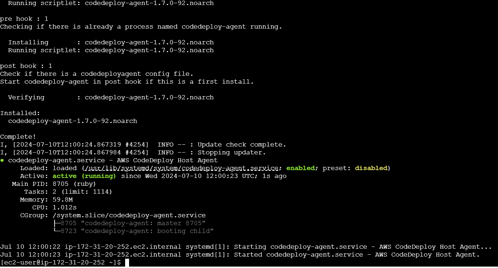
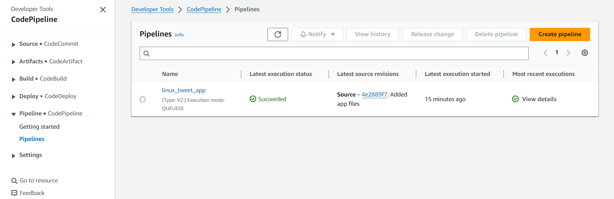

# Linux Tweet App

This is an NGINX website that allows the user to send a tweet.

## To build and run the container on local machine

Clone the repository on local machine using `git clone`.

[Install docker](https://docs.aws.amazon.com/serverless-application-model/latest/developerguide/install-docker.html) on local machine.

**Build** :

```
docker build -t linux_tweet_app .
```

**Run** :

```
docker run -d -p 80:80 linux_tweet_app
```

**Access the app** :

After the container is up and running, access the app using the `server_ip:80` on the web browser.

## AWS services used 

- [Amazon EC2](https://docs.aws.amazon.com/AWSEC2/latest/UserGuide/concepts.html)

- [Amazon S3](https://docs.aws.amazon.com/AmazonS3/latest/userguide/Welcome.html)

- [AWS IAM](https://docs.aws.amazon.com/IAM/latest/UserGuide/introduction.html)

- [Amazon ECR](https://docs.aws.amazon.com/AmazonECR/latest/userguide/what-is-ecr.html)

- [AWS CodeCommit](https://docs.aws.amazon.com/codecommit/latest/userguide/welcome.html)

- [AWS CodeBuild](https://docs.aws.amazon.com/codebuild/latest/userguide/welcome.html)

- [AWS CodeDeploy](https://docs.aws.amazon.com/codedeploy/latest/userguide/welcome.html)

- [AWS CodePipeline](https://docs.aws.amazon.com/codepipeline/latest/userguide/welcome.html)

## AWS CodePipeline

AWS CodePipeline is a continuous delivery service that automates the building, testing, and deployment of your software into production.

#### AWS CodePipeline specifically helps you to - 
- Automate release processes
- Establish a consistent release process
- Speed up delivery while improving quality
- Integrate your existing tools 

#### Some important concepts of CodePipeline - 

**Pipeline** - A pipeline is a workflow construct that describes how software changes go through a release process. Each pipeline is made up of a series of stages.

**Stages** - A stage is a logical unit you can use to isolate an environment and to limit the number of concurrent changes in that environment. Each stage is made up of a series of serial or parallel actions.

**Actions** - An action is a set of operations performed on application code and configured so that the actions run in the pipeline at a specified point. 

**Artifacts** - Artifacts refer to the collection of data, such as application source code, built applications, dependencies, definitions files, templates, and so on, that is worked on by pipeline actions. Artifacts can be the set of files produced by some actions (output artifacts) and consumed by others (input artifacts).

Mainly, CodePipeline consists of 3 stages; namely, `Source`, `Build` and `Deploy`. CodePipeline provides options to choose the provider for each stage. 

In this project, instead of integrating other tools with AWS **CodePipeline** we are going to use AWS **CodeCommit**, **CodeBuild** and **CodeDeploy** services to set up a CICD pipeline using AWS DevOps tools.

## AWS CodeCommit

AWS CodeCommit is a version control service hosted by Amazon Web Services that you can use to privately store and manage assets (such as documents, source code, and binary files) in the AWS cloud. It eliminates the need for you to manage your own source control system or worry about scaling its infrastructure.

Pricing for Free-tier Account first 5 users includes - 
- 5,000 repositories per account; up to 25,000 upon request
- 50 GB-month of storage
- 10,000 Git requests/month

## AWS CodeBuild

AWS CodeBuild is a fully managed build service in the AWS cloud. It compiles your source code, runs unit tests, and produces artifacts that are ready to deploy. CodeBuild eliminates the need to provision, manage, and scale your own build servers. It provides prepackaged build environments for popular programming languages and build tools. You can also customize build environments to use your own build tools. CodeBuild scales automatically to meet peak build requests.

AWS CodeBuild uses simple pay-as-you-go pricing. The rate depends on the selected compute type. Build Duration is calculated in minutes, from the time you submit your build until your build is terminated, rounded up to the nearest minute.

## AWS CodeDeploy

AWS CodeDeploy is a deployment service that automates application deployments to Amazon EC2 instances, on-premises instances, serverless Lambda functions, or Amazon ECS services. You can deploy a nearly unlimited variety of application content. You do not need to make changes to your existing code before you can use CodeDeploy. The service scales with your infrastructure so you can easily deploy to one instance or thousands.


## Deploying Application on AWS

After reviewing the necessary AWS services for this project, we can begin by deploying our **Linux Tweet App** on an EC2 instance using AWS CodePipeline.

#### Step 1 :- Create an [IAM user](https://docs.aws.amazon.com/IAM/latest/UserGuide/getting-started-iam-user.html) 

Access your AWS console using your Admin account and create a user specifically for this project. 

When creating the user, attach the following policies : 

- `AmazonEC2FullAccess`

- `AmazonS3FullAccess`

- `IAMFullAccess`

- `AmazonEC2ContainerRegistryFullAccess`

- `AWSCodeCommitFullAccess`

- `AWSCodeBuildAdminAccess`

- `AWSCodeDeployFullAccess`

- `AWSCodePipelineFullAccess`

> **NOTE**: After creating the user, download the CSV file that contains the Username and Password.

We need to create **[HTTPS Git credentials for AWS CodeCommit](https://docs.aws.amazon.com/codecommit/latest/userguide/setting-up-gc.html)** for this user, as this information is required to connect to CodeCommit.

> **NOTE**: Download the CSV file containing the Username and Password for CodeCommit.

Log out of the Admin account and log in using the newly created user account.

#### Step 2 :- Create a [CodeCommit repository](https://docs.aws.amazon.com/codecommit/latest/userguide/how-to-create-repository.html)


1. Give a name to the repository - `linux_tweet_app`

2. Copy the **"Clone HTTPS URL"** of the repository.


3. [Install](https://git-scm.com/book/en/v2/Getting-Started-Installing-Git) **git** on your machine.

4. Execute the following command on terminal - ```git clone <codecommit-repo-https-url>```

    This will prompt you to enter the Username and Password for the CodeCommit repository.


5. After cloning the repository, create the application files :
    
    - [index.html](index.html)
    
    - [Dockerfile](Dockerfile)

    - [build.sh](build.sh) 

    - [run.sh](run.sh)


6. Push the local source code to CodeCommit repository :

```
git status 
git add .
git commit -m "Added app files"
git push -u origin main
```

#### Step 3 :- Create [S3 buckets](https://docs.aws.amazon.com/AmazonS3/latest/userguide/creating-bucket.html) to store artifacts

- Build artifacts bucket :

    Create an S3 bucket to store the build artifacts produced by CodeBuild with the following properties - 

    1. View the **region** - `us-east-1`, in which the S3 bucket is being created and ensure it is same as that of the CodeCommit repository.

    2. Name - `cicd-linux-tweet-app-build-artifacts`

    3. Bucket type - `General Purpose`

    4. Object Ownership - `ACLs disabled`

    5. Disable `Block Public Access`

    6. Enable `Bucket Versioning`

    7. Use Default encryption - `Amazon S3 managed key (SSE-S3)`


- Pipeline artifacts bucket :

    Create an S3 bucket to store the pipeline artifacts (Source and Build) produced by CodePipeline with the following properties -

    1. Region - `us-east-1`, (same as build artifacts bucket)

    2. Name - `cicd-linux-tweet-app-pipeline-artifacts`

    3. Keep the remaining properties similar to the build artifacts bucket.

#### Step 4 :- Create a [Private repository](https://docs.aws.amazon.com/AmazonECR/latest/userguide/repository-create.html) in ECR registry

Set the following properties to the private repository : 

1. Visibility settings - `Private`

2. Repository name - `linux_tweet_app`

#### Step 5 :- Create [CodeBuild project](https://docs.aws.amazon.com/codebuild/latest/userguide/getting-started-create-build-project-console.html)

1. In the source code, create a file - `buildspec.yml`

2. Refer the [buildspec.yml](buildspec.yml)

    In this file, we have used an environment variable - `AWS_ACCOUNT_ID` in order to avoid publishing sensitive data. We can also use this approach to pass keys, passwords, etc. and set these environment variables during creation of build project.

3. Push the buildspec.yml file to CodeCommit repository.

4. Create a build project with following properties :

    - Project name - `linux_tweet_app`

    - Source provider - `AWS CodeCommit`
        - Repository - `linux_tweet_app`
        - Reference type - `branch`
        - Branch name - `main`

    - Environment :
        - Provisioning model - `On-demand`
        - Environment image - `Managed image`
        - Compute - `EC2`
        - Operating system - `Amazon Linux` (of your choice)
        - Runtime(s) - `Standard`
        - Image - `aws/codebuild/amazonlinux2-x86_64-standard:5.0` (choose latest)
        - Image version - `Always use the latest image for this runtime version`
        - Service role - `New service role`
            - Name - `linux_tweet_app_codeBuild_role`
        - Additional configuration : 
            - Enable the `Privileged` flag that allows you to build Docker images or your builds to get elevated privileges.
            - Set the **Environment Variables** - 
                - Name - `AWS_ACCOUNT_ID`
                - Value - `<your-AWS-acc-ID>`
        

    - Build specifications - `Use a buildspec file` (keep the buildspec file in root directory of source code)

    - Artifacts :
        - Type - `Amazon S3`
        - Bucket name - `cicd-projects-artifacts-store`
        - Name - `linux_tweet_app_artifacts.zip` (folder name to store the artifacts)
        - Artifacts packaging - `Zip`

> **NOTE**: Do not build the project yet; the build will fail. The CodeBuild service needs permissions to access ECR since we are pushing our docker image to the ECR private repository.

#### Step 6 :- Modify CodeBuild IAM role

The default CodeBuild service role created during the build project setup does not have permissions to access the ECR private repository. So we are going to attach the required policy to the CodeBuild role.

1. Go to **IAM** > **Roles** > **Search** - `linux_tweet_app_codeBuild_role`

2. Click on **Permissions** > **Add permissions** > **Attach policies**

3. Search the below mentioned policies and click **Add permissions** - 

    - `AmazonEC2ContainerRegistryFullAccess`

    - `AmazonS3FullAccess` (required during CodePipeline)

4. Now you can start the build process. 


#### Step 7 :- Create IAM roles for CodeDeploy service and EC2 instance

- IAM role for **CodeDeploy** 

    This role will be used by the CodeDeploy service to deploy our application on the EC2 instance. 

    1. Go to **IAM** > **Roles** > **Create role**

    2. Select the following properties - 

        - Trusted entity type - `AWS service`

        - Service or use case - `CodeDeploy`

        This will attach the `AWSCodeDeployRole` policy to the role we are creating.

    3. Enter name - `linux_tweet_app_codeDeploy_role`

    4. Review the properties and create role.

- IAM role for **EC2** instance

    We will attach this role to our EC2 instance where we are going to deploy our application.

    1. Click - **Create role**

    2. Select the following properties - 

        - Trusted entity type - `AWS service`

        - Service or use case - `EC2`

    3. Attach the below mentioned policies to this role - 

        - `AmazonEC2RoleforAWSCodeDeploy`

        - `AmazonS3FullAccess`

        - `AWSCodeDeployFullAccess`

    4. Enter name - `linux_tweet_app_ec2_codeDeploy_role`

    5. Review the properties and create role.

#### Step 8 :- Create an EC2 instance

We need to create an EC2 instance to deploy our application.

1. Go to **EC2** > **Instances** > **Launch Instances**

2. Enter name - `linux_tweet_app`

3. OS Images - `Amazon Linux 2023 AMI` (Free-tier)

4. Instance type - `t2.micro`

5. Key pair - Select an existing key pair or create a new one.

6. Choose an existing security group or create a new one with following inboud rules :

    - `Allow SSH traffic from Anywhere` - Port 22

    - `Allow HTTPS traffic from the internet` - Port 443

    - `Allow HTTP traffic from the internet` - Port 80

7. Keep the storage as default - `8 GiB gp3` Root volume.

8. In **Advanced details**, choose **IAM instance profile** - `linux_tweet_app_ec2_codeDeploy_role`.

#### Step 9 :- Install Docker and CodeDeploy agent 

After the EC2 instance - `linux_tweet_app`, is in `Running` state, SSH into the instance using the key pair attached to it.

> You can use MobaXterm, Terminus, etc. as SSH clients.

- Install Docker 

    You can either run the script [install-docker.sh](install-docker.sh) or can refer the [Docker install doc](https://docs.aws.amazon.com/serverless-application-model/latest/developerguide/install-docker.html#install-docker-instructions).

    - Run script - 

        1. Create the script :

            ```
            nano install-docker.sh
            ```
        
        2. Provide `Execute` permissions to the script :

            ```
            chmod +x install-docker.sh
            ```

        3. Execute the script :

            ```
            ./install-docker.sh
            ```

        This will install docker on the EC2 instance.

    

- Install CodeDeploy agent

    Run the script [install-codeDeploy-agent.sh](install-codeDeploy-agent.sh) or refer the [AWS documentation](https://docs.aws.amazon.com/codedeploy/latest/userguide/codedeploy-agent-operations-install-linux.html).

    - Run script - 

        1. Create the script :

            ```
            nano install-codeDeploy-agent.sh
            ```
        
        2. Provide `Execute` permissions to the script :

            ```
            chmod +x install-codeDeploy-agent.sh
            ```

        3. Execute the script :

            ```
            ./install-codeDeploy-agent.sh
            ```

        This will install CodeDeploy agent on the EC2 instance.

    


    

#### Step 10 :- Set up CodeDeploy 

- Create **`appspec.yml`** file in the source code

    Refer [appspec.yml](appspec.yml). Here, we are using two scripts to deploy our application :
    1. [build.sh](build.sh) - build docker image 

    2. [run.sh](run.sh) - run the application docker image

    Once you have created these files, push the source to CodeCommit.

- Create Application -

    1. Go to **CodeDeploy** > **Create application**

    2. Set the properties - 
    
        - Application name - `linux_tweet_app`

        - Compute platform - `EC2/on-premises`

- Create Deployment Group - 

    1. Deployment group name - `linux_tweet_app_dep_grp`

    2. Service role - `linux_tweet_app_codeDeploy_role`

    3. Deployment type - `In place`

    4. Environment configuration - `Amazon EC2 instances`

        - Key - `Name`
        - Value - `linux_tweet_app`

        This helps CodeDeploy to identify the instances using the tag "**Name**".

    5. Install AWS CodeDeploy Agent - `Never`

        We have installed the CodeDeploy Agent manually earlier to avoid version compatibility issues.

    6. Deployment configuration - `CodeDeployDefault.AllAtOnce`

    7. Disable `load balancing`.

- Create Deployment - 

    1. Deployment group - `linux_tweet_app_dep_grp`

    2. Revision type - `Application is stored in Amazon S3`

    3. Revision location - Copy the S3 URI of the build artifacts bucket - `cicd-linux-tweet-app-build-artifacts`


#### Step 11 :- Create a pipeline in CodePipeline

- Pipeline Settings - 

    1. Pipeline name - `linux_tweet_app`

    2. Execution mode - `Queued`

    3. Service role - `New service role`

        - Role Name - `linux_tweet_app_codePipeline_role`
        
    4. Advanced settings : 

        - Artifact store - `Custom location`

        - Bucket - `cicd-linux-tweet-app-pipeline-artifacts`

- Source Stage - 

    1. Source provider - `AWS CodeCommit`

    2. Repository name - `linux_tweet_app`

    3. Branch name - `main`

    4. Detection options - `AWS CodePipeline`

    5. Output artifact format - `CodePipeline default`

- Build Stage - 

    1. Build provider - `AWS CodeBuild`

    2. Region - `US East (N. Virginia)`

    3. Project name - `linux_tweet_app`

    4. Build type - `Single Build`

- Deploy Stage -

    1. Deploy provider - `AWS CodeDeploy`

    2. Region - `US East (N. Virginia)`

    3. Application name - `linux_tweet_app`

    4. Deployment group - `linux_tweet_app_dep_grp`

After you have created the pipeline, it will be triggered automatically. The first time execution of the pipeline will **FAIL** since the CodePipeline service role does not have the necessary permissions to access ECR repository.

#### Step 12 :- Modify CodePipeline IAM role.

1. Go to **IAM** > **Roles** > **Search** - `linux_tweet_app_codePipeline_role`

2. Click on **Permissions** > **Add permissions** > **Attach policies**

3. Search the below mentioned policies and click **Add permissions** -

    - `AmazonEC2ContainerRegistryFullAccess`

    - `AmazonS3FullAccess`

    - `AWSCodeBuildAdminAccess`

    - `AWSCodeDeployFullAccess`

4. Now go to **CodePipeline** > **linux_tweet_app**. Click **Release changes** to trigger the pipeline.




## Accessing the Application 

1. Go to **EC2** > **Instances** > **linux_tweet_app**

2. Copy the **Public IPv4 address** of the instance.

3. Open a New Tab on the browser and enter the public IP of the instance - `Public_IP:80`

**VOILA !!**


